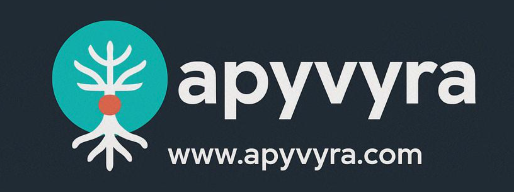

# Apyvyra: [www.apyvyra.com](https://apyvyra.com/)

* This project builds upon the free online training offered through live classes at [codando.live](https://www.codando.live), expanding the learning experience with practical, hands-on development.
  * The codando.live project gives any Brazilian or Portuguese speaker the opportunity to learn coding with a focus on solid fundamentals.
  * It is a comprehensive course, starting from the basics and covering everything needed to build a full-stack application.
  * It has [381 classes on a YouTube playlist](https://www.youtube.com/playlist?list=PLBQmBWUPdMJSCssCE1uEkqIA6f2o_zYWZ)
  * It covers the following topics:
    * Programming Logic
    * C# and .NET API
    * Object-Oriented Programming
    * Data Structures
    * Backend with ASP.NET Core C# Web API
    * SQL
    * Frontend Development
      * Angular
      * React
  * This project continues by applying everything covered in the [codando.live](https://www.codando.live) course to build a real, fully functional full-stack application.
  * Unlike the codando.live project, I decided to speak in English to encourage participants to learn and practice English.

* Apy Yvyra: means "Given freely" in tupi-guarani, a native language from Brazil

## Project Overview

* [Project Youtube playlist](https://www.youtube.com/playlist?list=PLBQmBWUPdMJTchLEOOp1tfEFsyHQI_Da5)
* [Project GitHub page](https://github.com/airamez/Apyvyra)
* I will try my best to have the live videos daily at 20:00 PST
* In this project, I’ll be building a full-stack ERP application with the help of AI (naturally!).
* My goal is to share my thought process, design decisions, and the trade-offs we all face when creating real applications.
* I’ll be reviewing everything generated by AI with care, making sure it’s useful and accurate.
* All content will be created live—no scripts, no rehearsals, just honest, hands-on live coding.
* Some classes might be slow, boring, or even a bit chaotic—just like real life as a software engineer!
* My aim is to mimic what truly happens in real-world situations.
* Unlike a real team, I’ll be making the decisions solo, but I’ll try to bring in some role-playing and discussion to show how collaboration and debates shape projects—especially when choosing tech stacks and design options.
* I’m passionate about teaching and sharing, and I hope you’ll join me on this journey.
* Throughout this project, we will focus on building the simplest architecture possible while still following best practices.
* The goal is not to address the complex scaling challenges faced by big data companies, but to provide a solid foundation for practical, maintainable applications.

## What is an ERP?

* An ERP (Enterprise Resource Planning) system is software that helps organizations manage and integrate their core business processes.
* It provides a unified platform for different departments, improving efficiency, data accuracy, and collaboration.

### **Overview**
  
* ERPs typically manage essential business entities such as products, customers, suppliers, and sales.
* These core modules help companies track inventory, process orders, manage customer relationships, and handle financial transactions.
* Nearly every company, regardless of size or industry, needs some form of ERP system to organize and streamline their operations.
* Even small businesses benefit from basic ERP features, while larger organizations rely on advanced, integrated solutions.
* In software engineering literature, examples of operations and data models frequently use entities such as product, customer, and order.
* These examples help illustrate how ERPs manage business processes and data relationships, and they form the basis for teaching concepts like normalization, transactions, and system integration.

### **Typical components of an ERP system include:**

* Inventory and Supply Chain Management
  * Manages the flow of goods and information, optimizing inventory and coordinating procurement for efficient operations.
* Sales and Customer Relationship Management (CRM)
  * Supports sales processes and customer engagement, helping track opportunities and improve satisfaction.
* Finance and Accounting
  * Handles financial transactions, budgeting, and reporting to ensure accurate bookkeeping and financial insights.
* Procurement
  * Automates purchasing, enabling efficient sourcing and cost control through streamlined vendor management.
* Manufacturing and Production
  * Manages planning, scheduling, and execution of manufacturing to ensure timely and quality product delivery.
* Human Resources (HR)
  * Streamlines employee management, payroll, and performance tracking to support workforce development and compliance.
* Project Management
  * Facilitates project planning, execution, and tracking to help teams achieve goals on schedule.

## Tech Stack

* IDE/Code Editor
  * Visual Studio CODE
* Pragramming Languages
  * TypeScript
  * C#
  * SQL
* Back-end
  * ASPX.NET Core Web API
* Data Layer
  * Entity Framework
* Front-end
  * React
* Database
  * Postgres/SQL Server
* Container
  * Docker
* AI Assistant Tool
  * GitHub Copilot

## Requirements

* The application will be single-tenant, ensuring that each customer’s data is isolated and secure.
* It should be easy to deploy and operate as an Application as a Service (AaaS), allowing organizations to quickly set up and use the system with minimal effort.
* The goal is to make the application easily deployable on any major cloud platform, such as:
  * [Azure](https://azure.microsoft.com/)
  * [AWS](https://aws.amazon.com/)
  * [Google Cloud](https://cloud.google.com/)
  * [Oracle Cloud](https://www.oracle.com/cloud/)
* As an open and free project, contributors and participants are encouraged to use the application to offer services, support, and customization—empowering them to build businesses and create value for their clients.
* The project will serve as an opportunity for beginners to collaborate and showcase their skills by contributing to an open source project

Welcome and enjoy!!!

## Classes

* [Class #1: Project Intro](https://www.youtube.com/live/frmYWxotqzc)
* [Class #2: Project Initialization - Frontend and Backend](https://www.youtube.com/live/Gfb2D8uVr08)
* [Class #3: Docker configuration](https://www.youtube.com/live/akO3wHmpjes)
* [Class #4: Database creation and User Controller](https://youtube.com/live/WJH4EvnNUfU)
* [Class #5: Third-party React components](https://youtube.com/live/raYyNkPZ2w8)
* [Class #6: Customer Regitration - frontend - UI](https://www.youtube.com/live/aZqesjmP4DQ)
* [Class #7: Customer Regitration - Encrypting the password](https://www.youtube.com/live/kkm1WHAEl2E)